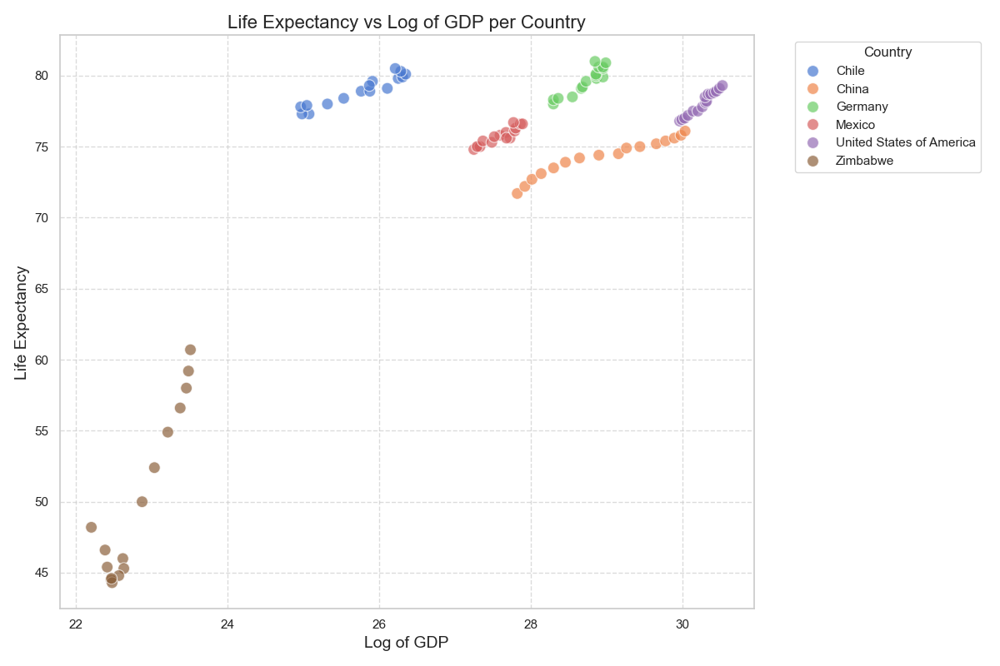
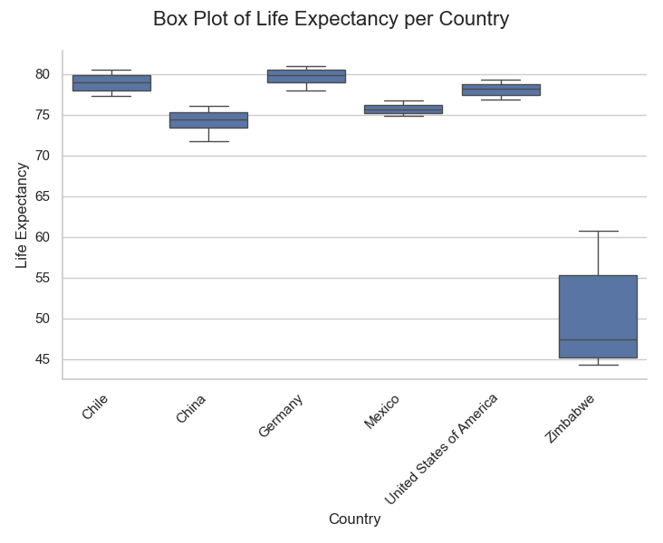

# GDP and Life Expectancy Analysis

## Introduction

This project explores the relationship between GDP and life expectancy across six diverse countries: Chile, China, Germany, Mexico, United States of America, and Zimbabwe. Using data from 2000 to 2015, we aim to uncover patterns and correlations that could offer insights into how economic growth might impact the health and longevity of populations.

## Data Sources

The data for this project were sourced from:
- **World Health Organization (WHO)**: Provided life expectancy data.
- **World Bank**: Offered GDP data.

These datasets were chosen for their reliability and comprehensiveness.

## Data Cleaning and Preparation

### Initial Inspection

We performed an initial inspection using `info()` and `describe()` methods to ensure there were no missing values and that data types were correctly loaded.

### Data Transformations

To facilitate better comparisons and visualizations, a log transformation was applied to the GDP data due to the wide range of GDP values across countries.

```python
df['log_GDP'] = df['GDP'].apply(np.log)
```

## Visualizations

### Scatter Plot Analysis



The scatter plot illustrates a general positive trend between log-transformed GDP and life expectancy, suggesting that wealthier countries tend to have longer life expectancies. However, correlation does not imply causation, and the relationship might be influenced by various factors.

### Bar Plot of GDP


This bar plot comparison visualizes the scale differences in GDP among the countries. The United States has the largest GDP by a significant margin, followed by China and Germany. Chile and Zimbabwe have the smallest GDPs.

### Box Plot of Life Expectancy



The box plot shows the distribution of life expectancy across countries:
- **Chile** and **Germany** have high and consistent life expectancies.
- **China** and **Mexico** show moderate life expectancies with some variability.
- **USA** has a high life expectancy, slightly lower than Germany and Chile.
- **Zimbabwe** exhibits the lowest and most variable life expectancy.

### Line Plots of GDP and Life Expectancy Over Time


The line plots display trends in GDP and life expectancy from 2000 to 2015:
- All countries show a general increase in both GDP and life expectancy.
- The trends highlight a positive correlation, with some country-specific variations.

## Conclusions

### Summary of Findings

The analysis reveals a positive correlation between GDP and life expectancy across the six countries. From 2000 to 2015, both GDP and life expectancy have shown an increasing trend.

### Interpretation of Results

While economic growth seems to correlate with improved life expectancy, this relationship is complex and influenced by various factors. Correlation does not imply causation, and it is essential to consider potential confounders, mediators, and colliders.

### Potential Confounding Factors

- **Advancements in Medical Technology and Healthcare Access**
- **Improvements in Living Standards and Education**
- **Global Economic Trends and Policies**

### Limitations and Future Research

- **Expanding the Analysis**: Including more countries and longer time periods.
- **Investigating Other Factors**: Exploring variables like healthcare expenditure, social welfare programs, and environmental factors.

### Final Thoughts

These findings have significant implications for policymakers. A holistic approach that considers healthcare, education, social policies, and economic strategies will be more effective in promoting both economic development and public health improvements. Acknowledging the complexity of these relationships is crucial for developing nuanced and effective policies.
